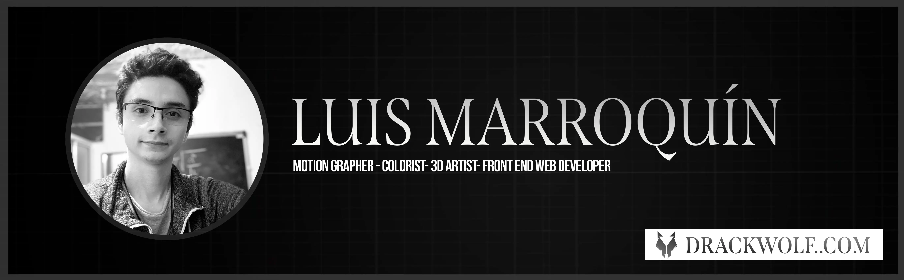

# 😄 Hi there! **Welcome to my Github page** 👋

💬 I'm Luis Marroquín, a Motion Grapher, VFX/3D Artist & Frontend Web Developer.

## 📫 Social Networks

## ⚡ Skills

## 📽️ My Tutorials
<!-- BEGIN YOUTUBE-CARDS -->

<!-- END YOUTUBE-CARDS -->

